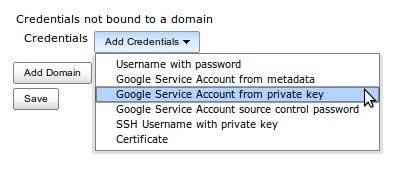
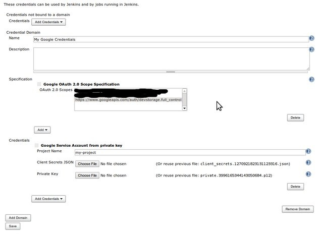

<!--
 Copyright 2019 Google LLC

 Licensed under the Apache License, Version 2.0 (the "License"); you may not use this file except in
 compliance with the License. You may obtain a copy of the License at

        https://www.apache.org/licenses/LICENSE-2.0

 Unless required by applicable law or agreed to in writing, software distributed under the License
 is distributed on an "AS IS" BASIS, WITHOUT WARRANTIES OR CONDITIONS OF ANY KIND, either express or
 implied. See the License for the specific language governing permissions and limitations under the
 License.
-->
# Google OAuth Plugin Documentation

This plugin implements the OAuth Credentials interfaces for surfacing [Google Service Accounts](https://cloud.google.com/iam/docs/understanding-service-accounts) to Jenkins. This plugin allows for the registration of Google Service Account Credentials with the Jenkins controller, which can be used to interact with Google APIs.

## Google OAuth Credentials

This plugin surfaces two Credential types for generating OAuth credentials for a Google service account:

1. [Google Service Account from private key](https://cloud.google.com/iam/docs/creating-managing-service-account-keys) use this option with the private key for your Google service account.  See our embedded help section for details on how/where this is obtained, or here.
    * You can create service accounts via the Google Developers Console, under APIs & auth → Credentials → Create new Client ID → Service account
    * The downloaded P12 key and the service account email address can then be used when adding the credential to Jenkins; or if you created a new JSON key, you can use that instead

1. [Google Service Account from metadata](https://cloud.google.com/compute/docs/storing-retrieving-metadata) use this option for obtaining the service account information from Google Compute Engine metadata. This option is only available when the Jenkins controller is run on a Google Compute Engine VM.

## Private Key Credentials

Credentials generated from a private key provide uninhibited access to your project as the robot, so we also surface the necessary Domain specification functionality to restrict the scopes for which such a credential may be used by plugins.

For example, if you only want this service account to be used for “Google Drive”, but there are plugins that might use “Google Calendar”, we want this credential to show up as an option for the former, but not the latter.

An example of a private key restricted for use with [Google Cloud Storage](https://github.com/jenkinsci/google-storage-plugin).

**NOTE**: As new plugins are installed, which bring in new OAuth scopes, this domain restriction allows those new scopes to be opt-in vs. opt-out.

## Metadata Credentials

Credentials obtained via [Google Compute Engine metadata](https://cloud.google.com/compute/docs/) are inherently limited to the scopes to which you bound the VM when it was provisioned.  You will see this set of scopes listed alongside the credential.

For an example of how to consume these credentials, please see our [Google Cloud Storage Plugin](https://github.com/jenkinsci/google-storage-plugin).

